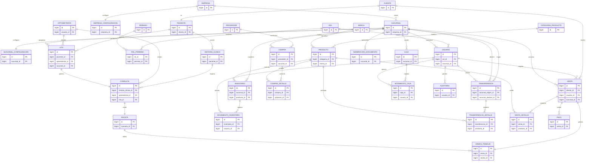

# Diagrama Entidad Relación (ERD)
## Sistema de Gestión Integral para Ópticas

```mermaid
erDiagram

EMPRESA ||--o{ SUCURSAL : posee

EMPRESA ||--|| EMPRESA_CONFIGURACION : configura

SUCURSAL ||--|| SUCURSAL_CONFIGURACION : configura

ROL ||--o{ USUARIO : asigna

ROL ||--o{ ROL_PERMISO : contiene

PERMISO ||--o{ ROL_PERMISO : pertenece

SUCURSAL ||--o{ USUARIO : pertenece

CLIENTE ||--|| PACIENTE : es

PACIENTE ||--o{ CITA : agenda

OPTOMETRISTA ||--o{ CITA : atiende

SUCURSAL ||--o{ CITA : programa

PACIENTE ||--o{ HISTORIA_CLINICA : posee

HISTORIA_CLINICA ||--o{ CONSULTA : registra

OPTOMETRISTA ||--o{ CONSULTA : realiza

CITA ||--|| CONSULTA : genera

CONSULTA ||--|| RECETA : emite

CATEGORIA_PRODUCTO ||--o{ PRODUCTO : clasifica

MARCA ||--o{ PRODUCTO : identifica

SUCURSAL ||--o{ INVENTARIO : mantiene

PRODUCTO ||--o{ INVENTARIO : controla

INVENTARIO ||--o{ MOVIMIENTO_INVENTARIO : registra

USUARIO ||--o{ MOVIMIENTO_INVENTARIO : ejecuta

SUCURSAL ||--o{ TRANSFERENCIA : origen

SUCURSAL ||--o{ TRANSFERENCIA : destino

USUARIO ||--o{ TRANSFERENCIA : solicita

TRANSFERENCIA ||--o{ TRANSFERENCIA_DETALLE : contiene

PRODUCTO ||--o{ TRANSFERENCIA_DETALLE : participa

PROVEEDOR ||--o{ COMPRA : suministra

SUCURSAL ||--o{ COMPRA : realiza

COMPRA ||--o{ COMPRA_DETALLE : contiene

PRODUCTO ||--o{ COMPRA_DETALLE : compra

CLIENTE ||--o{ VENTA : realiza

USUARIO ||--o{ VENTA : registra

SUCURSAL ||--o{ VENTA : procesa

VENTA ||--o{ VENTA_DETALLE : contiene

PRODUCTO ||--o{ VENTA_DETALLE : vende

VENTA ||--|| ORDEN_TRABAJO : genera

RECETA ||--o{ ORDEN_TRABAJO : utiliza

SUCURSAL ||--o{ CAJA : posee

CAJA ||--o{ MOVIMIENTO_CAJA : registra

USUARIO ||--o{ MOVIMIENTO_CAJA : ejecuta

VENTA ||--o{ PAGO : recibe

SUCURSAL ||--o{ NUMERACION_DOCUMENTO : administra

USUARIO ||--o{ AUDITORIA : genera

EMPRESA {
    bigint id PK
}

EMPRESA_CONFIGURACION {
    bigint id PK
    bigint empresa_id FK
}

SUCURSAL {
    bigint id PK
    bigint empresa_id FK
}

SUCURSAL_CONFIGURACION {
    bigint id PK
    bigint sucursal_id FK
}

ROL {
    bigint id PK
}

PERMISO {
    bigint id PK
}

ROL_PERMISO {
    bigint rol_id FK
    bigint permiso_id FK
}

USUARIO {
    bigint id PK
    bigint rol_id FK
    bigint sucursal_id FK
}

CLIENTE {
    bigint id PK
}

PACIENTE {
    bigint id PK
    bigint cliente_id FK
}

OPTOMETRISTA {
    bigint id PK
    bigint usuario_id FK
}

CITA {
    bigint id PK
    bigint paciente_id FK
    bigint optometrista_id FK
    bigint sucursal_id FK
}

HISTORIA_CLINICA {
    bigint id PK
    bigint paciente_id FK
}

CONSULTA {
    bigint id PK
    bigint historia_clinica_id FK
    bigint optometrista_id FK
    bigint cita_id FK
}

RECETA {
    bigint id PK
    bigint consulta_id FK
}

CATEGORIA_PRODUCTO {
    bigint id PK
}

MARCA {
    bigint id PK
}

PRODUCTO {
    bigint id PK
    bigint categoria_id FK
    bigint marca_id FK
}

INVENTARIO {
    bigint id PK
    bigint sucursal_id FK
    bigint producto_id FK
}

MOVIMIENTO_INVENTARIO {
    bigint id PK
    bigint inventario_id FK
    bigint usuario_id FK
}

TRANSFERENCIA {
    bigint id PK
    bigint sucursal_origen_id FK
    bigint sucursal_destino_id FK
}

TRANSFERENCIA_DETALLE {
    bigint id PK
    bigint transferencia_id FK
    bigint producto_id FK
}

PROVEEDOR {
    bigint id PK
}

COMPRA {
    bigint id PK
    bigint proveedor_id FK
    bigint sucursal_id FK
}

COMPRA_DETALLE {
    bigint id PK
    bigint compra_id FK
    bigint producto_id FK
}

VENTA {
    bigint id PK
    bigint cliente_id FK
    bigint usuario_id FK
    bigint sucursal_id FK
}

VENTA_DETALLE {
    bigint id PK
    bigint venta_id FK
    bigint producto_id FK
}

ORDEN_TRABAJO {
    bigint id PK
    bigint venta_id FK
    bigint receta_id FK
}

CAJA {
    bigint id PK
    bigint sucursal_id FK
}

MOVIMIENTO_CAJA {
    bigint id PK
    bigint caja_id FK
    bigint usuario_id FK
}

PAGO {
    bigint id PK
    bigint venta_id FK
}

NUMERACION_DOCUMENTO {
    bigint id PK
    bigint sucursal_id FK
}

AUDITORIA {
    bigint id PK
    bigint usuario_id FK
}
```
