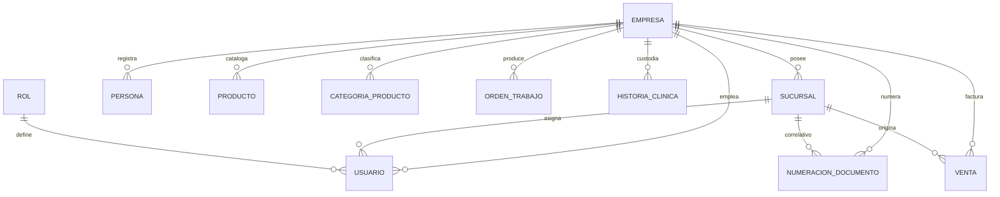
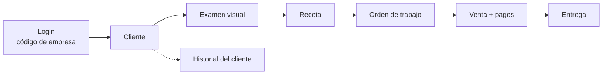

# Diagrama Entidad Relación (ERD)
## Sistema de Gestión Integral para Ópticas

```mermaid
erDiagram

%% =========================================
%% ORGANIZACION
%% =========================================

EMPRESA ||--|| EMPRESA_CONFIGURACION : configura
EMPRESA ||--o{ SUCURSAL : posee
SUCURSAL ||--|| SUCURSAL_CONFIGURACION : configura

%% =========================================
%% SEGURIDAD
%% =========================================

ROL ||--o{ USUARIO : asigna
ROL ||--o{ ROL_PERMISO : contiene
PERMISO ||--o{ ROL_PERMISO : pertenece

%% =========================================
%% PERSONAS
%% =========================================

PERSONA ||--|| CLIENTE : es
PERSONA ||--|| PACIENTE : es
PERSONA ||--|| USUARIO : es
PERSONA ||--|| OPTOMETRISTA : es

SUCURSAL ||--o{ USUARIO : pertenece

USUARIO ||--|| OPTOMETRISTA : representa

%% =========================================
%% AGENDA MEDICA
%% =========================================

PACIENTE ||--o{ CITA : agenda
OPTOMETRISTA ||--o{ CITA : atiende
SUCURSAL ||--o{ CITA : programa

%% =========================================
%% HISTORIA CLINICA
%% =========================================

PACIENTE ||--o{ HISTORIA_CLINICA : posee

HISTORIA_CLINICA ||--o{ CONSULTA : registra

OPTOMETRISTA ||--o{ CONSULTA : realiza

CITA ||--|| CONSULTA : genera

CONSULTA ||--|| RECETA : emite

%% =========================================
%% PRODUCTOS
%% =========================================

CATEGORIA_PRODUCTO ||--o{ PRODUCTO : clasifica
MARCA ||--o{ PRODUCTO : identifica

%% =========================================
%% INVENTARIO
%% =========================================

SUCURSAL ||--o{ INVENTARIO : mantiene
PRODUCTO ||--o{ INVENTARIO : controla

INVENTARIO ||--o{ MOVIMIENTO_INVENTARIO : registra

USUARIO ||--o{ MOVIMIENTO_INVENTARIO : ejecuta

%% =========================================
%% TRANSFERENCIAS
%% =========================================

SUCURSAL ||--o{ TRANSFERENCIA : origen
SUCURSAL ||--o{ TRANSFERENCIA : destino

USUARIO ||--o{ TRANSFERENCIA : solicita

TRANSFERENCIA ||--o{ TRANSFERENCIA_DETALLE : contiene

PRODUCTO ||--o{ TRANSFERENCIA_DETALLE : participa

%% =========================================
%% COMPRAS
%% =========================================

PROVEEDOR ||--o{ COMPRA : suministra

SUCURSAL ||--o{ COMPRA : realiza

COMPRA ||--o{ COMPRA_DETALLE : contiene

PRODUCTO ||--o{ COMPRA_DETALLE : compra

%% =========================================
%% VENTAS
%% =========================================

CLIENTE ||--o{ VENTA : realiza

USUARIO ||--o{ VENTA : registra

SUCURSAL ||--o{ VENTA : procesa

VENTA ||--o{ VENTA_DETALLE : contiene

PRODUCTO ||--o{ VENTA_DETALLE : vende

%% =========================================
%% ORDENES DE TRABAJO
%% =========================================

VENTA ||--|| ORDEN_TRABAJO : genera

RECETA ||--o{ ORDEN_TRABAJO : utiliza

%% =========================================
%% CAJA
%% =========================================

SUCURSAL ||--o{ CAJA : posee

CAJA ||--o{ MOVIMIENTO_CAJA : registra

USUARIO ||--o{ MOVIMIENTO_CAJA : ejecuta

%% =========================================
%% PAGOS
%% =========================================

VENTA ||--o{ PAGO : recibe

%% =========================================
%% CONFIGURACION
%% =========================================

SUCURSAL ||--o{ NUMERACION_DOCUMENTO : administra

%% =========================================
%% AUDITORIA
%% =========================================

USUARIO ||--o{ AUDITORIA : genera

%% =========================================
%% ENTIDADES
%% =========================================

EMPRESA {
    bigint id PK
}

EMPRESA_CONFIGURACION {
    bigint id PK
    bigint empresa_id FK
}

SUCURSAL {
    bigint id PK
    bigint empresa_id FK
}

SUCURSAL_CONFIGURACION {
    bigint id PK
    bigint sucursal_id FK
}

ROL {
    bigint id PK
}

PERMISO {
    bigint id PK
}

ROL_PERMISO {
    bigint rol_id FK
    bigint permiso_id FK
}

PERSONA {
    bigint id PK
}

CLIENTE {
    bigint id PK
    bigint persona_id FK
}

PACIENTE {
    bigint id PK
    bigint persona_id FK
}

USUARIO {
    bigint id PK
    bigint persona_id FK
    bigint rol_id FK
    bigint sucursal_id FK
}

OPTOMETRISTA {
    bigint id PK
    bigint persona_id FK
    bigint usuario_id FK
}

CITA {
    bigint id PK
    bigint paciente_id FK
    bigint optometrista_id FK
    bigint sucursal_id FK
}

HISTORIA_CLINICA {
    bigint id PK
    bigint paciente_id FK
}

CONSULTA {
    bigint id PK
    bigint historia_clinica_id FK
    bigint optometrista_id FK
    bigint cita_id FK
}

RECETA {
    bigint id PK
    bigint consulta_id FK
}

CATEGORIA_PRODUCTO {
    bigint id PK
}

MARCA {
    bigint id PK
}

PRODUCTO {
    bigint id PK
    bigint categoria_id FK
    bigint marca_id FK
}

INVENTARIO {
    bigint id PK
    bigint sucursal_id FK
    bigint producto_id FK
}

MOVIMIENTO_INVENTARIO {
    bigint id PK
    bigint inventario_id FK
    bigint usuario_id FK
}

TRANSFERENCIA {
    bigint id PK
    bigint sucursal_origen_id FK
    bigint sucursal_destino_id FK
}

TRANSFERENCIA_DETALLE {
    bigint id PK
    bigint transferencia_id FK
    bigint producto_id FK
}

PROVEEDOR {
    bigint id PK
}

COMPRA {
    bigint id PK
    bigint proveedor_id FK
    bigint sucursal_id FK
}

COMPRA_DETALLE {
    bigint id PK
    bigint compra_id FK
    bigint producto_id FK
}

VENTA {
    bigint id PK
    bigint cliente_id FK
    bigint usuario_id FK
    bigint sucursal_id FK
}

VENTA_DETALLE {
    bigint id PK
    bigint venta_id FK
    bigint producto_id FK
}

ORDEN_TRABAJO {
    bigint id PK
    bigint venta_id FK
    bigint receta_id FK
}

CAJA {
    bigint id PK
    bigint sucursal_id FK
}

MOVIMIENTO_CAJA {
    bigint id PK
    bigint caja_id FK
    bigint usuario_id FK
}

PAGO {
    bigint id PK
    bigint venta_id FK
}

CONFIGURACION_SISTEMA {
    bigint id PK
}

PARAMETRO_CATALOGO {
    bigint id PK
}

NUMERACION_DOCUMENTO {
    bigint id PK
    bigint sucursal_id FK
}

AUDITORIA {
    bigint id PK
    bigint usuario_id FK
}
```



---

# Resumen del ERD

## Núcleo Organizacional

```text
EMPRESA
SUCURSAL
```

## Seguridad

```text
ROL
PERMISO
ROL_PERMISO
USUARIO
```

## Personas

```text
PERSONA
CLIENTE
PACIENTE
OPTOMETRISTA
```

## Historia Clínica

```text
CITA
HISTORIA_CLINICA
CONSULTA
RECETA
```

## Inventario

```text
PRODUCTO
CATEGORIA_PRODUCTO
MARCA
INVENTARIO
MOVIMIENTO_INVENTARIO
TRANSFERENCIA
TRANSFERENCIA_DETALLE
```

## Comercial

```text
PROVEEDOR
COMPRA
COMPRA_DETALLE

VENTA
VENTA_DETALLE

PAGO
```

## Operación

```text
ORDEN_TRABAJO

CAJA
MOVIMIENTO_CAJA
```

## Configuración

```text
CONFIGURACION_SISTEMA
PARAMETRO_CATALOGO
NUMERACION_DOCUMENTO
```

## Auditoría

```text
AUDITORIA
```

---

---

# Multiempresa (v1.1)

`EMPRESA` es el tenant. Las entidades raíz de cada módulo pertenecen a una empresa (`empresa_id`); las demás
heredan la pertenencia a través de su padre y además llevan `empresa_id` para aislar por consulta directa.



Tablas globales (sin `empresa_id`): `empresa`, `rol`, `permiso`, `rol_permiso`.
Reglas de unicidad y aislamiento: `05-Modelo-Logico.md`.

## Flujo operativo implementado


